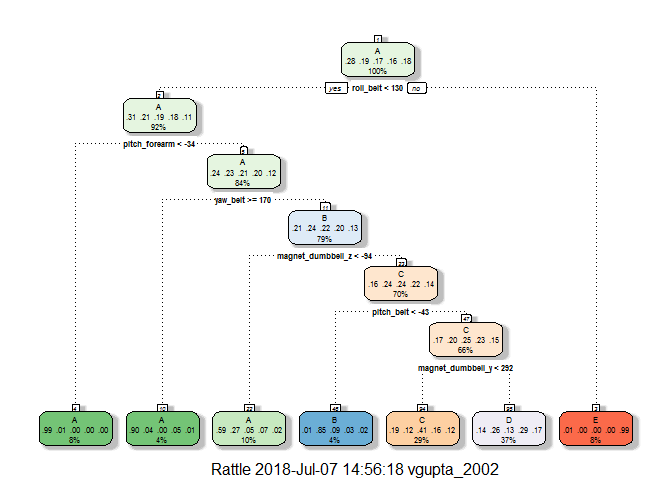

# Coursera - Practical Machine Learning Project


###Background###

Using devices such as Jawbone Up, Nike FuelBand, and Fitbit it is now possible to collect a large amount of data about personal activity relatively inexpensively. These type of devices are part of the quantified self movement - a group of enthusiasts who take measurements about themselves regularly to improve their health, to find patterns in their behavior, or because they are tech geeks. One thing that people regularly do is quantify how much of a particular activity they do, but they rarely quantify how well they do it. In this project, your goal will be to use data from accelerometers on the belt, forearm, arm, and dumbell of 6 participants. They were asked to perform barbell lifts correctly and incorrectly in 5 different ways. More information is available from the website here: http://web.archive.org/web/20161224072740/http:/groupware.les.inf.puc-rio.br/har (see the section on the Weight Lifting Exercise Dataset).

###Libraries###
We first load the R packages needed for analysis and then download the training and testing data sets from the given URLs

```r
library(caret); 
```

```
## Loading required package: lattice
```

```
## Loading required package: ggplot2
```

```r
library(rattle); 
```

```
## Rattle: A free graphical interface for data mining with R.
## Version 4.1.0 Copyright (c) 2006-2015 Togaware Pty Ltd.
## Type 'rattle()' to shake, rattle, and roll your data.
```

```r
library(rpart); 
library(rpart.plot);
library(randomForest);
```

```
## randomForest 4.6-12
```

```
## Type rfNews() to see new features/changes/bug fixes.
```

```
## 
## Attaching package: 'randomForest'
```

```
## The following object is masked from 'package:ggplot2':
## 
##     margin
```


```r
TrainData <- read.csv(url("https://d396qusza40orc.cloudfront.net/predmachlearn/pml-training.csv"),header=TRUE)
dim(TrainData)
```

```
## [1] 19622   160
```


```r
TestData <- read.csv(url("https://d396qusza40orc.cloudfront.net/predmachlearn/pml-testing.csv"),header=TRUE)
dim(TestData)
```

```
## [1]  20 160
```

The training data set is made of 19622 observations on 160 columns. We can notice that many columns have NA values or blank values on almost every observation. So we will remove them, because they will not produce any information. The first seven columns give information about the people who did the test. We will not take them in our model.


```r
# Here we get the indexes of the columns having at least 90% of NA or blank values on the training dataset
indColToRemove <- which(colSums(is.na(TrainData) |TrainData=="")>0.9*dim(TrainData)[1]) 
TrainDataClean <- TrainData[,-indColToRemove]
TrainDataClean <- TrainDataClean[,-c(1:7)]
dim(TrainDataClean)
```

```
## [1] 19622    53
```


```r
# We do the same for the test set
indColToRemove <- which(colSums(is.na(TestData) |TestData=="")>0.9*dim(TestData)[1]) 
TestDataClean <- TestData[,-indColToRemove]
TestDataClean <- TestDataClean[,-1]
dim(TestDataClean)
```

```
## [1] 20 59
```

####Data Splitting####
In order to get out-of-sample errors, we split the cleaned training set trainData into a training set (train, 70%) for prediction and a validation set (valid 30%) to compute the out-of-sample errors.


```r
set.seed(1000) 
inTrain <- createDataPartition(TrainDataClean$classe, p = 0.7, list = FALSE)
train <- TrainDataClean[inTrain, ]
valid <- TrainDataClean[-inTrain, ]
```

###Prediction Algorithms###
We use classification trees and random forests to predict the outcome.

####Classification trees####

We will consider 5-fold cross validation (default setting in trainControl function is 10) when implementing the algorithm to save a little computing time.


```r
control <- trainControl(method = "cv", number = 5)
fit_rpart <- train(classe ~ ., data = train, method = "rpart", 
                   trControl = control)
print(fit_rpart, digits = 4)
```

```
## CART 
## 
## 13737 samples
##    52 predictor
##     5 classes: 'A', 'B', 'C', 'D', 'E' 
## 
## No pre-processing
## Resampling: Cross-Validated (5 fold) 
## Summary of sample sizes: 10990, 10988, 10990, 10989, 10991 
## Resampling results across tuning parameters:
## 
##   cp       Accuracy  Kappa  
##   0.03967  0.5382    0.41008
##   0.04246  0.4930    0.33692
##   0.11515  0.3148    0.04664
## 
## Accuracy was used to select the optimal model using  the largest value.
## The final value used for the model was cp = 0.03967.
```


```r
fancyRpartPlot(fit_rpart$finalModel)
```

<!-- -->

Now we will predict outcomes using validation set and show prediction result


```r
predict_rpart <- predict(fit_rpart, valid)
(conf_rpart <- confusionMatrix(valid$classe, predict_rpart))
```

```
## Confusion Matrix and Statistics
## 
##           Reference
## Prediction   A   B   C   D   E
##          A 992   5 344 330   3
##          B 196 195 204 544   0
##          C  27  25 697 277   0
##          D  32   5 333 594   0
##          E  14   7 219 354 488
## 
## Overall Statistics
##                                           
##                Accuracy : 0.504           
##                  95% CI : (0.4911, 0.5168)
##     No Information Rate : 0.3567          
##     P-Value [Acc > NIR] : < 2.2e-16       
##                                           
##                   Kappa : 0.3833          
##  Mcnemar's Test P-Value : < 2.2e-16       
## 
## Statistics by Class:
## 
##                      Class: A Class: B Class: C Class: D Class: E
## Sensitivity            0.7867  0.82278   0.3879   0.2830  0.99389
## Specificity            0.8525  0.83286   0.9195   0.9023  0.88988
## Pos Pred Value         0.5926  0.17120   0.6793   0.6162  0.45102
## Neg Pred Value         0.9361  0.99115   0.7736   0.6942  0.99938
## Prevalence             0.2143  0.04027   0.3054   0.3567  0.08343
## Detection Rate         0.1686  0.03314   0.1184   0.1009  0.08292
## Detection Prevalence   0.2845  0.19354   0.1743   0.1638  0.18386
## Balanced Accuracy      0.8196  0.82782   0.6537   0.5926  0.94188
```


```r
(accuracy_rpart <- conf_rpart$overall[1])
```

```
##  Accuracy 
## 0.5039932
```

From the confusion matrix, the accuracy rate is 0.5. Using classification tree does not predict the outcome classe very well.

####Random forests####
Since classification tree method does not perform well, we try random forest method instead.


```r
fit_rf <- train(classe ~ ., data = train, method = "rf", 
                   trControl = control)
print(fit_rf, digits = 4)
```

```
## Random Forest 
## 
## 13737 samples
##    52 predictor
##     5 classes: 'A', 'B', 'C', 'D', 'E' 
## 
## No pre-processing
## Resampling: Cross-Validated (5 fold) 
## Summary of sample sizes: 10989, 10990, 10989, 10991, 10989 
## Resampling results across tuning parameters:
## 
##   mtry  Accuracy  Kappa 
##    2    0.9900    0.9873
##   27    0.9897    0.9870
##   52    0.9860    0.9822
## 
## Accuracy was used to select the optimal model using  the largest value.
## The final value used for the model was mtry = 2.
```

Now we will predict outcomes using validation set and show prediction result


```r
predict_rf <- predict(fit_rf, valid)
(conf_rf <- confusionMatrix(valid$classe, predict_rf))
```

```
## Confusion Matrix and Statistics
## 
##           Reference
## Prediction    A    B    C    D    E
##          A 1671    3    0    0    0
##          B    4 1134    1    0    0
##          C    0    8 1017    1    0
##          D    0    0   17  946    1
##          E    0    0    0    4 1078
## 
## Overall Statistics
##                                          
##                Accuracy : 0.9934         
##                  95% CI : (0.991, 0.9953)
##     No Information Rate : 0.2846         
##     P-Value [Acc > NIR] : < 2.2e-16      
##                                          
##                   Kappa : 0.9916         
##  Mcnemar's Test P-Value : NA             
## 
## Statistics by Class:
## 
##                      Class: A Class: B Class: C Class: D Class: E
## Sensitivity            0.9976   0.9904   0.9826   0.9947   0.9991
## Specificity            0.9993   0.9989   0.9981   0.9964   0.9992
## Pos Pred Value         0.9982   0.9956   0.9912   0.9813   0.9963
## Neg Pred Value         0.9991   0.9977   0.9963   0.9990   0.9998
## Prevalence             0.2846   0.1946   0.1759   0.1616   0.1833
## Detection Rate         0.2839   0.1927   0.1728   0.1607   0.1832
## Detection Prevalence   0.2845   0.1935   0.1743   0.1638   0.1839
## Balanced Accuracy      0.9984   0.9947   0.9904   0.9955   0.9991
```


```r
(accuracy_rf <- conf_rf$overall[1])
```

```
## Accuracy 
## 0.993373
```

For this dataset, random forest method is way better than classification tree method. The accuracy rate is 0.991. This may be due to the fact that many predictors are highly correlated. Random forests chooses a subset of predictors at each split and decorrelate the trees. This leads to high accuracy, although this algorithm is sometimes difficult to interpret and computationally inefficient.

###Prediction on Testing Set###
We now use random forests to predict the outcome variable classe for the testing set.

```r
(predict(fit_rf, TestDataClean))
```

```
##  [1] B A B A A E D B A A B C B A E E A B B B
## Levels: A B C D E
```


